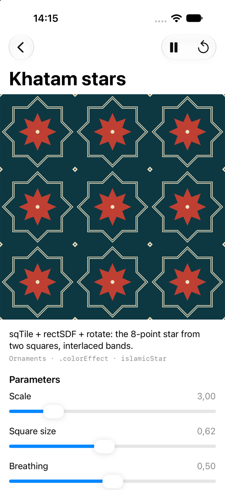

# LYGIA Metal Viewer

A SwiftUI app for browsing the Metal port of the [LYGIA shader library](https://github.com/patriciogonzalezvivo/lygia) on macOS, iOS and visionOS.


- **40 live demos:** noise, SDFs, tiling, color, distortion, lighting (`pbr`, `raymarch`) and geometric ornaments, each with controls and its source.
- **Playground (macOS):** write Metal with `#include "lygia/..."` and see it render as you type.
- **Immersive (visionOS):** a raymarched LYGIA scene drawn by the app's own Metal renderer through Compositor Services ([details](docs/immersive.md)).

| All demos | Playground |
|---|---|
|  |  |

| iPhone | Vision Pro (immersive, simulator) |
|---|---|
|  |  |

## Build

Requires Xcode 26+ and [XcodeGen](https://github.com/yonaskolb/XcodeGen).

```sh
git clone --recursive https://github.com/elkraneo/lygia-metal-viewer.git
cd lygia-metal-viewer
xcodegen generate
open LygiaViewer.xcodeproj
```

Builds are signed ad-hoc. For a device, or to use another LYGIA checkout, create `Config/Local.xcconfig` (git-ignored):

```
VIEWER_CODE_SIGN_STYLE = Automatic
VIEWER_CODE_SIGN_IDENTITY = Apple Development
VIEWER_DEVELOPMENT_TEAM = <your team ID>
LYGIA_SOURCE_ROOT = /path/to/folder/containing/lygia
```

`scripts/check-shaders.sh` compiles every demo shader without building the app. `-tour <ids>` steps through demos for screen recordings.

## LYGIA

`External/lygia` tracks the `metal/lighting` branch of [elkraneo/lygia](https://github.com/elkraneo/lygia). It includes Metal fixes and ports not yet in upstream LYGIA, so some demos don't build against upstream `main`.

## Adding a demo

1. Add `LygiaViewer/Shaders/<Module>/<id>.metal` with one `[[ stitchable ]]` function named `<id>` (signature in `Shaders/Common.h`).
2. Add a `Demo(...)` entry in `LygiaViewer/Model/DemoCatalog.swift`.

## License

MIT for the viewer's code ([LICENSE](LICENSE)). LYGIA has its own license: [Prosperity](https://prosperitylicense.com/versions/3.0.0) for non-commercial use, [Patron](https://lygia.xyz/license) for commercial use.
