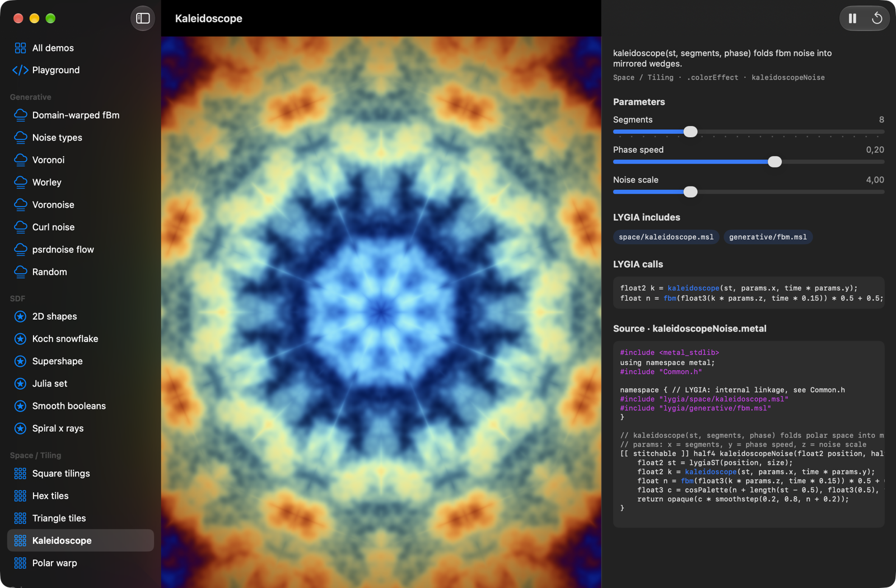
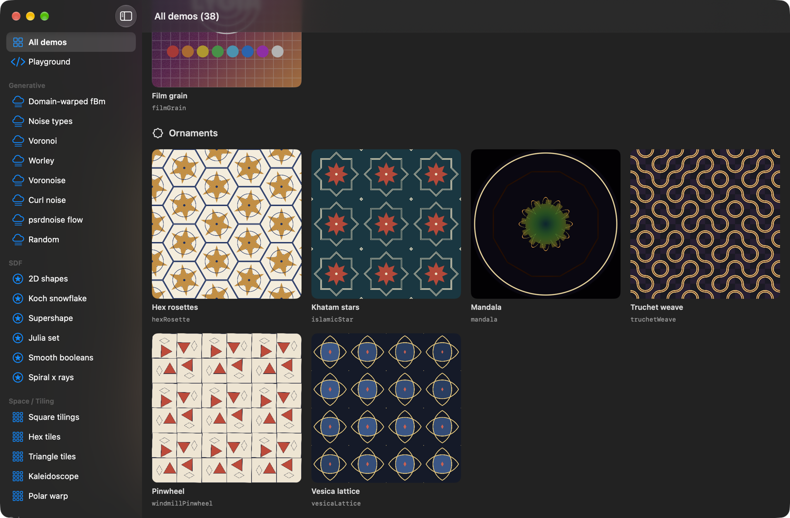
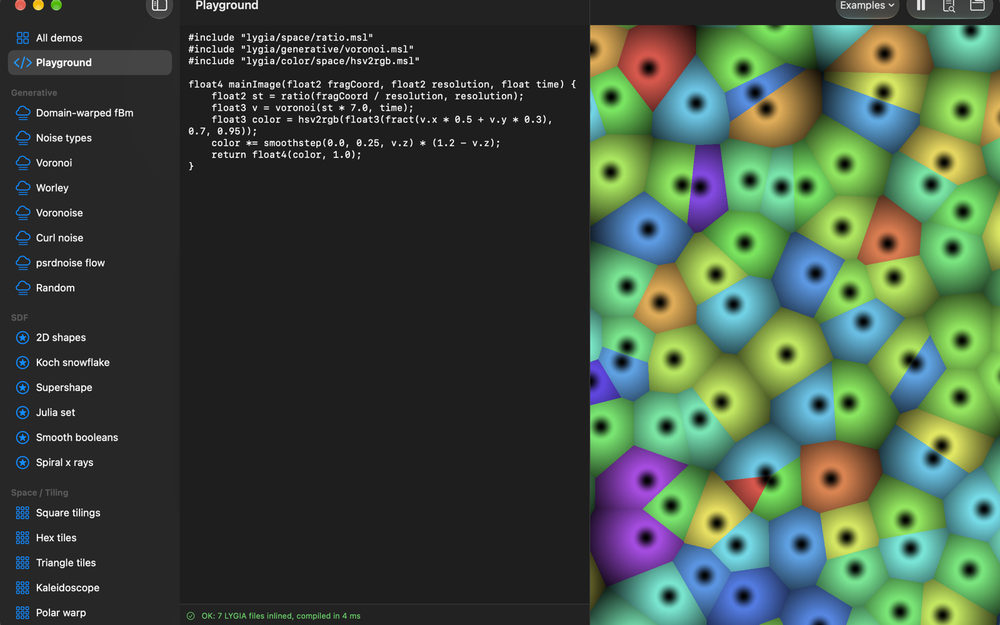
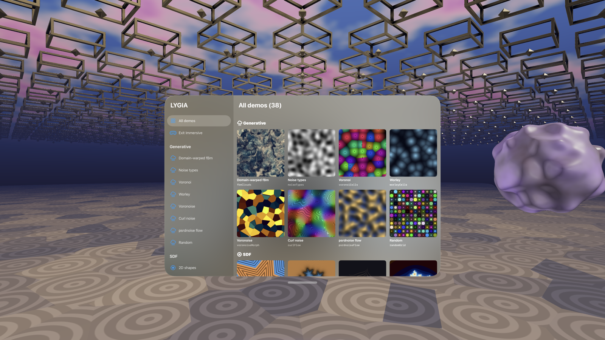

# LYGIA Metal Viewer

A SwiftUI app for browsing the Metal (MSL) port of the [LYGIA shader library](https://github.com/patriciogonzalezvivo/lygia) on macOS, iOS and visionOS.



- **40 live demos** across generative noise, SDFs, tiling, color, draw, distort, lighting (LYGIA's `pbr` and `raymarch`) and geometric ornaments. Each demo has parameter controls and shows the LYGIA files it includes, the calls it makes and its full source.
- **Playground (macOS):** write Metal with `#include "lygia/..."` and see it render as you type. The app inlines the includes itself, because Metal's runtime compiler can't read files.
- **Immersive (visionOS):** a fully immersive, raymarched LYGIA scene drawn by the app's own Metal renderer through Compositor Services (see [Immersive](#immersive-visionos)).
- Demos are SwiftUI `[[ stitchable ]]` shaders (`.colorEffect`, `.layerEffect`, `.distortionEffect`), so they run the same on all three platforms.

| All demos | Playground |
|---|---|
|  |  |

## Build

Requires Xcode 26 or later (tested with Xcode 27) and [XcodeGen](https://github.com/yonaskolb/XcodeGen).

```sh
git clone --recursive https://github.com/elkraneo/lygia-metal-viewer.git
cd lygia-metal-viewer
xcodegen generate
open LygiaViewer.xcodeproj
```

The target builds for macOS, iOS and visionOS. Builds are signed ad-hoc. To run on a device, create `Config/Local.xcconfig` (git-ignored) with your team:

```
VIEWER_CODE_SIGN_STYLE = Automatic
VIEWER_CODE_SIGN_IDENTITY = Apple Development
VIEWER_DEVELOPMENT_TEAM = <your team ID>
```

`scripts/check-shaders.sh` compiles and links every demo shader without building the app.

For screen recordings, `-tour` steps through demos by itself and sweeps each one's first slider:

```sh
open LygiaViewer.app --args -tour kaleidoscopeNoise,islamicStar,mandala,gallery -tourInterval 3.5
```

## LYGIA version

`External/lygia` is a submodule on the `metal/lighting` branch of [elkraneo/lygia](https://github.com/elkraneo/lygia). That branch builds on the Metal fixes and ports proposed upstream in [#318](https://github.com/patriciogonzalezvivo/lygia/pull/318), [#319](https://github.com/patriciogonzalezvivo/lygia/pull/319) and [#320](https://github.com/patriciogonzalezvivo/lygia/pull/320), and adds a Metal port of LYGIA's lighting and sample modules that isn't proposed upstream yet. Several demos (star, flower and gear SDFs, kaleidoscope, triTile, the immersive scene's lighting, ...) don't compile against upstream `main` until those land.

To build against another checkout, set it in `Config/Local.xcconfig`:

```
LYGIA_SOURCE_ROOT = /path/to/folder/containing/lygia
```

## Adding a demo

1. Add `LygiaViewer/Shaders/<Module>/<id>.metal` with one `[[ stitchable ]]` function named `<id>`, using the signature documented in `Shaders/Common.h`.
2. Add a `Demo(...)` entry in `LygiaViewer/Model/DemoCatalog.swift`.

LYGIA's Metal functions are `static inline` on this branch, so any number of `.metal` files can include the same LYGIA file, even with different options ([why not plain `inline`](https://gist.github.com/elkraneo/c7794ed71015fd07858dab10f00077be)). If a demo defines `raymarchMap`, make it `static inline` too. The older demos still wrap their includes in `LYGIA_BEGIN` / `LYGIA_END` (an anonymous namespace), the workaround from before; it's harmless and not needed for new demos.

## Immersive (visionOS)

On visionOS the sidebar has an **Immersive (Metal)** button. It opens a fully immersive space rendered by the app's own Metal renderer through [Compositor Services](https://developer.apple.com/documentation/compositorservices): a raymarched SDF scene built from LYGIA `sdf/`, `space/`, `generative/` and `color/` functions, drawn per eye. Launch with `-immersive YES` to open it at startup (useful in Simulator):

```sh
xcrun simctl launch booted io.210x7.LygiaViewer -immersive YES
```



- `LygiaViewer/Immersive/`: `ImmersiveSpace.swift` (the `ImmersiveSpace` + `CompositorLayer`, layer configuration, open/close button), `ImmersiveRenderer.swift` (render loop), `ImmersiveUniforms.swift` (Swift copies of the shader structs).
- `LygiaViewer/Shaders/Immersive/`: `ImmersiveScene.metal` (scene, raymarcher, entry points), `ImmersiveLighting.h` (all lighting, in `immersiveShade()`), `ImmersiveTypes.h` (uniforms).
- **Render loop:** runs on its own thread through a `TaskExecutor`, never on the main thread. Each frame: `queryNextFrame`, `predictTiming`, wait for the optimal input time, query the drawables, predict the head pose with ARKit `WorldTrackingProvider.queryDeviceAnchor(atTimestamp:)` at the presentation time, set it on the drawable, encode, `encodePresent`, commit.
- **Layout:** layered when the device supports it (both eyes in one 2D-array texture), drawn in a single pass with vertex amplification. The eye's slice and viewport come from `MTLVertexAmplificationViewMapping`. Dedicated and shared layouts use the same code: views are grouped by texture, with one pass per texture.
- **Per-eye camera:** `drawable.computeProjection(convention: .rightUpBack, viewIndex:)` gives the projection. The camera is `deviceAnchor.originFromAnchorTransform * view.transform`. The fragment shader rebuilds the world ray from the inverse projection and that camera transform.
- **Depth:** Compositor Services only supports reverse-Z (1 = near, 0 = far; `depthRange` is `(far, near)`, far = infinity by default). The shader projects the hit point with the eye's view-projection and writes `clip.z / clip.w` to `[[depth(any)]]`. Misses write 0. The compositor uses this depth to reproject frames.
- **Foveation:** turned on when `capabilities.supportsFoveation` (on device; Simulator doesn't support it). The drawable's rasterization rate map goes on the render pass. With a rate map, `[[position]]` is in physical (compressed) coordinates, not screen coordinates. So the shader doesn't use it: it rebuilds rays from an NDC value interpolated from the full-screen triangle, which stays correct either way. If you need screen pixels in a fragment shader, convert with `rasterizationRateMap.mapPhysicalToScreenCoordinates` (or pass the map's parameter buffer to the shader).
- **Simulator:** it renders one view (no stereo) and reports the head at the space origin rather than about 1.6 m above the floor. When the first tracked head pose is below 0.8 m, the renderer lifts the scene so the ornaments stay at eye height.

Surfaces are shaded with LYGIA's physically based `pbr()` (`lighting/pbr.msl`), with one directional sun set through LYGIA's `LIGHT_*` options and LYGIA's `fakeCube` as the environment; all of it is in `immersiveShade()` in `ImmersiveLighting.h`. To use a real environment map, pass a `texturecube<float>` as the last argument: `pbr(mat, shadingData, cubemap)`. You can also define `RAYMARCH_MAP_FNC` as `immersiveMap` and let `lighting/raymarch` run the march too; keep the ray setup and depth output in `immersiveFragment`.

## Notes

- On visionOS, SwiftUI shaders work in windows and volumes. RealityKit materials on visionOS don't accept custom Metal shaders (they use Shader Graph). For your own Metal on visionOS, use the Compositor Services immersive space described above.
- The macOS app isn't sandboxed, so the Playground can read LYGIA from disk.

## License

The viewer's code is MIT licensed (see [LICENSE](LICENSE)). LYGIA has its own license: it's free for non-commercial use under the [Prosperity License](https://prosperitylicense.com/versions/3.0.0), and commercial use needs the [Patron License](https://lygia.xyz/license).
